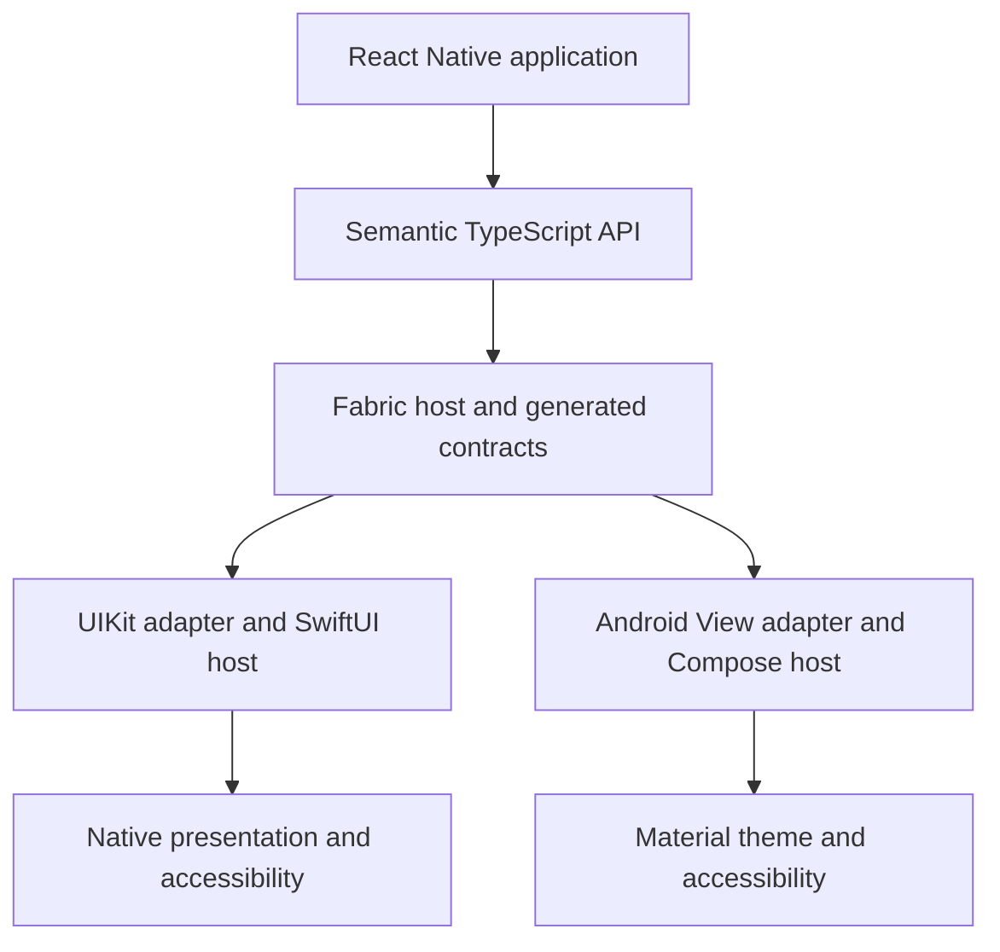

# Native UIX architecture direction

Status: Proposed · 2026-10-04

The recommended investigation path starts with individual Fabric controls, then evaluates native screen containers. A hybrid renderer is a hypothesis, not an accepted implementation decision.

In component mode, React Native owns the outer frame and sibling layout. Native code owns the control's internal layout, input feedback and accessibility. Intrinsic sizing must be validated against Fabric constraints; a platform view's intrinsic size alone is not proof of Yoga interoperability.

In screen mode, React Native supplies the outer frame and semantic data. Native code owns content layout and scrolling. Arbitrary React children are excluded from the first screen experiment; callbacks remain in JavaScript and native events refer to stable action IDs.

The application owns routes, persistence and business state. Native UIX does not introduce a second navigation stack. Capability and adaptation logic remains local until multiple components justify a shared policy module.

Implementation acceptance requires executed builds and lifecycle, sizing, state and accessibility evidence on both platforms. The public API remains experimental until that evidence exists.
